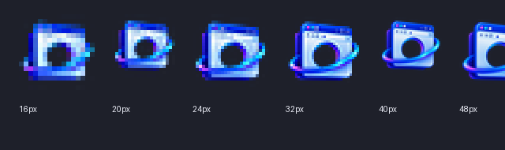

<div align="center">



# 小窗浏览器

**专为单屏玩家打造的 Windows 画中画浏览器**

让攻略、视频和直播悬浮在游戏上方；需要操作游戏时，窗口可以自动让路。

[](https://github.com/azurplain/Mini-Window-Browser/releases/latest)
[](https://github.com/azurplain/Mini-Window-Browser/releases)
[](https://www.microsoft.com/windows)
[](https://developer.microsoft.com/microsoft-edge/webview2/)
[](LICENSE.txt)

[下载最新版](https://github.com/azurplain/Mini-Window-Browser/releases/latest) · [用户手册](用户手册.md) · [更新日志](CHANGELOG.md) · [问题反馈](https://github.com/azurplain/Mini-Window-Browser/issues)

</div>

---

## 它能做什么

小窗浏览器最初为“单显示器玩游戏时查看地图和视频”而开发。它不是一个追求大而全的传统浏览器，而是一个轻量、便携、始终在手边的游戏辅助窗口。

<table>
<tr>
<td width="50%" valign="top">

### 沉浸式挖孔

只保留鼠标附近的圆形画面，其余区域透明并穿透点击。视频不会挡住游戏操作，圆孔半径可调。

</td>
<td width="50%" valign="top">

### 整体透明

完整显示小窗内容；鼠标移入时自动隐藏，移出后恢复。基础不透明度可按百分比调节。

</td>
</tr>
<tr>
<td valign="top">

### 场景预设

保存窗口位置、大小、全部标签页、当前标签、热键和沉浸设置。不同游戏布局可以一键切换。

</td>
<td valign="top">

### 全局媒体控制

适配 Bilibili、抖音、YouTube，并回退到通用 HTML5 视频。支持播放、选集、点按跳转和长按快进/快退。

</td>
</tr>
<tr>
<td valign="top">

### 多标签与书签

标签数量增加时自动收窄；标签栏右键可关闭当前、其他或全部标签。书签使用下拉列表，两步即可跳转。

</td>
<td valign="top">

### 游戏环境热键

键盘、鼠标中键和双侧键均可绑定。低级钩子与 Raw Input 双通道提高管理员游戏和不同鼠标驱动下的可用性。

</td>
</tr>
</table>

## v1.4 亮点

- 使用 Direct2D / DirectWrite 重做 Fluent 风格原生界面，跟随 Windows 深浅色和 DPI。
- 全新的蓝紫应用图标统一用于 EXE、任务栏、Alt-Tab、窗口和系统托盘。
- 重构窗口状态机，修复最小化、隐藏恢复、托盘、无缝最大化和多显示器位置恢复。
- 网页视频全屏只覆盖小窗内容区，可选按视频比例临时调整窗口，退出后恢复原位置。
- 沉浸挖孔固定为完全透明且孔外不透明；整体透明模式独立提供透明度调节。
- 预设可保存并恢复全部标签页；书签改为下拉式管理；标签栏支持批量关闭。
- 新增长按快进/快退、后台媒体热键、输入保护、GPU 兼容模式和视频掉帧诊断。
- WebView2 SDK 升级至 1.0.4078.44，源码拆分为状态、窗口、UI、热键、输入、媒体和配置模块。

完整变更请查看 [CHANGELOG.md](CHANGELOG.md)。

## 快速开始

### 系统要求

- Windows 10 或 Windows 11，推荐 x64 系统。
- Microsoft Edge WebView2 Runtime。Windows 10/11 通常已经安装；缺失时可从[微软官网下载](https://developer.microsoft.com/microsoft-edge/webview2/)。

### 下载与运行

1. 在 [Releases](https://github.com/azurplain/Mini-Window-Browser/releases/latest) 下载 `Mini-Window-Browser-v1.4.0-x64.zip`。
2. 将压缩包完整解压到普通可写目录，不要只从压缩包内直接运行 EXE。
3. 保持 `XiaoChuang.exe` 与 `WebView2Loader.dll` 位于同一目录。
4. 双击 `XiaoChuang.exe`，在 Windows UAC 窗口中选择“是”。

程序使用管理员权限，是为了让热键能够在同样以管理员身份运行的游戏和启动器中工作。Windows 不支持便携程序“一次授权后永久免提示”，因此每次启动都会出现 UAC。

首次运行会在程序目录生成 `config.ini` 和 WebView2 用户数据目录。升级时可以直接覆盖程序文件，但请保留自己的 `config.ini`。

## 默认快捷键

| 按键 | 功能 | 行为 |
|:---:|---|---|
| `0` | 沉浸模式 | 在普通窗口与当前沉浸风格之间切换 |
| `9` | 隐藏 / 显示 | 一键隐藏或拉起小窗 |
| `` ` `` | 播放 / 暂停 | 控制当前活动视频 |
| `5` | 快退 | 点按回退 5 秒，长按连续倒退 |
| `6` | 快进 | 点按前进 5 秒，长按临时加速 |
| `7` / `8` | 上一集 / 下一集 | 优先调用网站适配器 |

所有快捷键都可在设置中改成键盘组合、鼠标中键、鼠标侧键 1 或侧键 2。输入保护开启时，网页输入框、地址栏和可识别的外部编辑控件会暂停媒体及沉浸热键；隐藏/显示键始终保留。

## 主要使用方式

### 两种沉浸模式

| | 挖孔穿透 | 整体透明 |
|---|---|---|
| 显示效果 | 鼠标周围圆形区域显示网页 | 显示完整窗口 |
| 操作底层程序 | 孔外透明且点击穿透 | 鼠标移入窗口时自动隐藏 |
| 可调项目 | 圆孔半径 | 基础不透明度 |
| 适用场景 | 地图标记、局部视频画面 | 直播、攻略和完整视频 |

### 窗口与网页全屏

- 右上角最大化按钮使用当前显示器工作区，保留小窗浏览器顶部栏且不留下缩放边框。
- 网页播放器请求全屏时，只覆盖小窗网页内容区，不会占满整块显示器。
- “按视频比例自动调整小窗”可减少网页全屏黑边；退出播放器全屏后恢复原窗口位置和大小。
- 真正绕过 Windows DWM 的独占全屏游戏无法被普通桌面顶层窗口覆盖。此时请把游戏切换为无边框全屏或窗口化全屏。

### 预设、书签与托盘

- 预设保存全部标签页、当前标签、窗口布局、沉浸设置、热键和常用开关；名称不可重复。
- 点击星标收藏当前网页，点击“书签”打开下拉列表，可直接访问、编辑或删除。
- 开启托盘模式后，最小化会隐藏到托盘；左键单击托盘图标恢复，右键可打开、进入设置或退出。

## 配置与隐私

- 设置、书签、预设和标签会话保存在程序目录的 `config.ini`。
- 浏览器缓存、Cookie 和网站登录状态保存在 `XiaoChuang.exe.WebView2` 目录。
- 小窗浏览器本身不会把配置、书签或诊断信息上传到项目服务器；网页内容和登录行为仍由对应网站及 WebView2 处理。
- 正式发布压缩包不包含任何开发者配置、Cookie、缓存、浏览历史或 PDB 调试文件。

## 从源码构建

### 依赖

- Visual Studio 2022，安装“使用 C++ 的桌面开发”工作负载。
- Windows 10/11 SDK。
- NuGet：Microsoft.Web.WebView2 1.0.4078.44、Microsoft.Windows.ImplementationLibrary。

### 构建

```powershell
git clone https://github.com/azurplain/Mini-Window-Browser.git
cd Mini-Window-Browser
msbuild .\小窗.slnx /m /t:Rebuild /p:Configuration=Release /p:Platform=x64
```

x86 构建将 `Platform` 改为 `x86`。核心测试目标不依赖第三方测试框架：

```powershell
.\x64\Release\XiaoChuang.Tests.exe
```

### 代码结构

```text
src/
├── Application.*            应用生命周期、主窗口与 UI
├── AppModel.h               应用状态与配置模型
├── ConfigStore.*            INI 配置和兼容迁移
├── WindowModeController.*   窗口模式、沉浸、全屏与置顶
├── HotkeyManager.*          键盘/鼠标热键、长按状态
├── InputGuard.*             输入焦点保护
├── MediaBridge.*            WebView2 媒体与站点适配
├── ThemeManager.*           Direct2D/DirectWrite 主题绘制
└── Diagnostics.*            系统、GPU 与视频诊断
```

## 文档

- [用户手册](用户手册.md)：完整设置说明、使用方法和问题排查。
- [v1.4 更新日志](CHANGELOG.md)：功能、修复、兼容性与已知限制。
- [发布验证报告](README-测试说明.md)：双架构测试、静态分析和人工验证项目。
- [第三方许可](THIRD_PARTY_NOTICES.txt)：WebView2 SDK 与 WIL 许可信息。

## 参与项目

欢迎通过 [Issues](https://github.com/azurplain/Mini-Window-Browser/issues) 报告问题或提出建议。反馈时建议附上设置页中的“复制诊断信息”、出现问题的网站、游戏窗口模式和复现步骤。

## 许可证

本项目基于 [GNU General Public License v3.0](LICENSE.txt) 开源。
